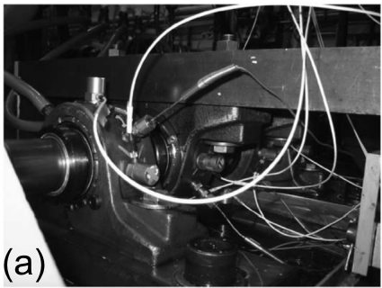
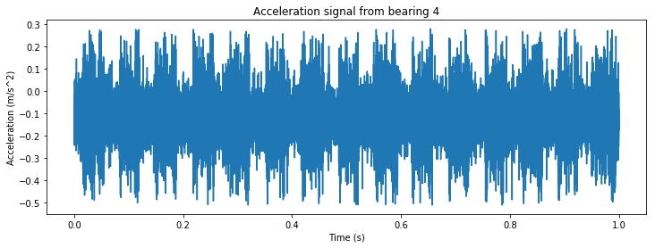

# Predictive bearing failure

## Achtergrond informatie

### Test opstelling
4 lagers zijn geinstalleerd aan een drijfas. De rotatiesnelheid is constant gehouden op 2000 RPM door een AC motor aangedreven door een drijfriem. Een lading van 2721.55 kg (6000 lbs) is toegevoegd en de lagers zijn continu ingesmeerd. Op de lagers zijn accelerometers geïnstalleerd zoals te zien in Figuur 1a. Een schematische afbeelding is te zien in Figuur 1b.

<table>
    <tr>
    <th> 
    <th> 
    </tr>
</table>  
Figuur 1. Opstelling van de lagers met de belasting en accelerometers (a) en Schematische weergave van de opstelling (b)

<table>
    <tr>
    <th>  
    <th>
    </tr>
</table>
Figuur 2. Failures van rollagers. Links een failure van het rol element en rechts een failure van de buitenring

### Data structuur
Alleen de data van de laatste lager is beschikbaar. De data is een test-to-failure experiment en elk bestand bestaat uit een 1 seconde snapshot van het signaal. Die seconde is verdeeld in 20,480 datapunten (sample rate van 20 kHz). Alle bestanden staan in volgorde van vroeg naar laat. Dit betekent dat de gezondheid van alle lagers hetzelfde of slechter is dan de vorige. Dit mag je niet gebruiken als feature. Tussen bijna alle snapshots zit 10 minuten. 

De classes zijn:
- 0: Vroeg stadium
- 1: Normaal
- 2: Verdacht
- 3: Rol element failure
- 4: Failure

## Inlezen van data


```python
from dataset.bearing_dataset import bearing_dataset
import os
```


```python
ds = bearing_dataset(os.path.join("dataset", "data"), "bearing_conditions.csv")
N = len(ds)
print("Deze dataset bevat {} observaties".format(N))
n_samples = len(ds[0]) # gebruik index om het bestand te krijgen
print("Elke observatie is 1 seconde met {} samples".format(n_samples))
```

    Deze dataset bevat 1724 observaties
    Elke observatie is 1 seconde met 20480 samples
    


```python
print(ds)
```

    Class bearing_dataset with files from 'dataset\data' and size (1724,). It holds the following files: ['0.txt', '1.txt', '10.txt'] ... ['997.txt', '998.txt', '999.txt'].
    Get full list of files with ds.files
    


```python
ds.labels.sample(n = 10)
```


<div>
<style scoped>
    .dataframe tbody tr th:only-of-type {
        vertical-align: middle;
    }

    .dataframe tbody tr th {
        vertical-align: top;
    }

    .dataframe thead th {
        text-align: right;
    }
</style>
<table border="1" class="dataframe">
  <thead>
    <tr style="text-align: right;">
      <th></th>
      <th>b4</th>
    </tr>
  </thead>
  <tbody>
    <tr>
      <th>1040</th>
      <td>2</td>
    </tr>
    <tr>
      <th>1202</th>
      <td>3</td>
    </tr>
    <tr>
      <th>1052</th>
      <td>2</td>
    </tr>
    <tr>
      <th>1159</th>
      <td>3</td>
    </tr>
    <tr>
      <th>96</th>
      <td>0</td>
    </tr>
    <tr>
      <th>221</th>
      <td>1</td>
    </tr>
    <tr>
      <th>231</th>
      <td>1</td>
    </tr>
    <tr>
      <th>962</th>
      <td>2</td>
    </tr>
    <tr>
      <th>461</th>
      <td>1</td>
    </tr>
    <tr>
      <th>362</th>
      <td>1</td>
    </tr>
  </tbody>
</table>
</div>


### Train test split


```python
ds_train, ds_test = ds.train_test_split(test_size=0.3)
print("Trainsize = {}\nTestsize = {}".format(len(ds_train), len(ds_test)))
```

    Trainsize = 1206
    Testsize = 518
    


```python
print(ds_train, "\n")
print(ds_test)
```

    Class bearing_dataset with files from 'dataset\data' and size (1206,). It holds the following files: ['689.txt', '762.txt', '1196.txt'] ... ['1682.txt', '380.txt', '454.txt'].
    Get full list of files with ds.files 
    
    Class bearing_dataset with files from 'dataset\data' and size (518,). It holds the following files: ['186.txt', '288.txt', '273.txt'] ... ['1074.txt', '1459.txt', '93.txt'].
    Get full list of files with ds.files
    

### Get signal


```python
import matplotlib.pyplot as plt
import numpy as np

fig = plt.figure(figsize = (12, 4))

signal = ds_train[0]
t = np.linspace(0, 1, len(signal))
plt.plot(t, signal)
plt.xlabel("Time (s)")
plt.ylabel("Acceleration (m/s^2)")
plt.title("Acceleration signal from bearing 4")
plt.show()
```


    

    


```python

```
